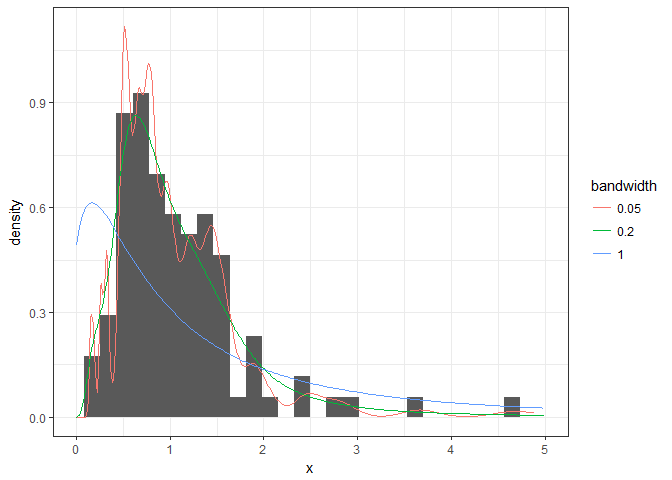
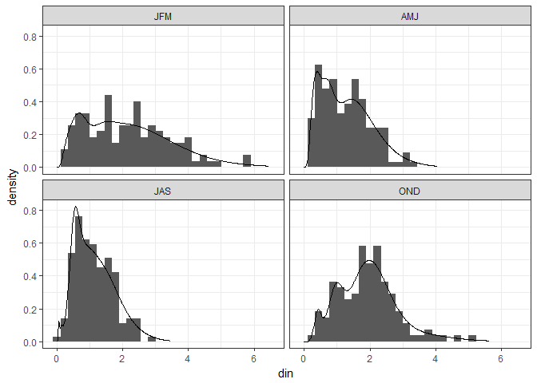

# KDE for wq time series
Marcus W. Beck, beck.marcus@epa.gov  

$$\hat{f}_h\left(x\right) = \frac{1}{n}\sum_{i = 1}^{n}K_h\left(x - x_i\right) = \frac{1}{nh}\sum_{i=1}^{n}K\left(\frac{x - x_i}{h}\right)$$

$x$ is iid, $K$ is the kernel function and $h$ is the bandwidth.  

What is the goal of the analysis?

* description of past trends (hydrological/management based impacts) and/or hypothesis testing
* scenario prediction
* method comparison (GAM?)

What are advantages of using KDE?

* non-parametric (local fitting) approach to estimate pdf (density function of iid data)
* not commonly applied to environmental, wq time series

Options to control - bandwidth (smoothing factor - over/under), kernel function (normal, uniform, triangular, biweight, triweight)

Not sure this is done for time series data - use AR model first, then kernel function on residuals? 


```r
library(ks)
library(tidyverse)
set.seed(8192)

x <- 2^rnorm(100)

bands <- c(0.05, 0.2, 1)
ests <- sapply(bands, function(bd){
  fhat <- kde(x = x, h = bd, positive=TRUE)
  out <- data.frame(bd = bd, fhat$eval.points, fhat$estimate) 
  out
  }, simplify = F) %>% 
  do.call('rbind', .) %>% 
  mutate(bd= factor(bd))
names(ests) <- c('bandwidth', 'x', 'y')

ggplot() + 
  geom_histogram(aes(x = x, y = ..density..)) + 
  geom_line(data = ests, aes(x = x, y = y, colour = bandwidth)) + 
  theme_bw() + 
  scale_x_continuous(limits = c(0, 5))
```

<!-- -->

Examples with SF Delta data:

```r
library(lubridate)
library(ks)
load(file = 'M:/docs/manuscripts/sftrends_manu/data/mods.RData')

dat <- filter(mods, Site_Code %in% 'P8' & resvar %in% 'din') %>% 
  .$data %>% 
  .[[1]] %>% 
  select(date, res, flo) %>% 
  mutate(
    res = exp(res),
    yr = year(date), 
    qrt = quarter(date),
    qrt = factor(qrt, levels = c(1, 2, 3, 4), labels = c('JFM', 'AMJ', 'JAS', 'OND'))
  ) %>% 
  rename(din = res) %>% 
  na.omit

kdat <- dat %>% 
  group_by(qrt) %>% 
  nest %>% 
  mutate(ests = map(data, function(x){
    vals <- as.numeric(na.omit(x$din))
    fhat <- kde(x = vals, positive = TRUE)
    out <- data.frame(val = fhat$eval.points, est = fhat$estimate)
    out
  })) %>% 
  select(-data) %>% 
  unnest

ggplot() +
  geom_histogram(data = dat, aes(x = din, y = ..density..)) +
  facet_wrap(~qrt) +
  geom_line(data = kdat, aes(x = val, y = est, group = qrt)) +
  theme_bw() 
```

<!-- -->


```r
library(KernSmooth)
library(np)

tomod <- dat %>% 
  mutate(
    date = as.numeric(date)
    )

bd <- with(tomod, dpill(date, din))
mod1 <- with(tomod, locpoly(date, din, bandwidth = bd)) %>% 
  data.frame


mod2 <- npregbw(formula = din ~ date, data = tomod)
```

```
## 
Multistart 1 of 1 |
Multistart 1 of 1 |
Multistart 1 of 1 |
Multistart 1 of 1 /
Multistart 1 of 1 -
Multistart 1 of 1 |
Multistart 1 of 1 |
                   
```

```r
mod2 <- npreg(mod2) %>% 
  fitted %>% 
  data.frame(x = tomod$date,  y = .)

mod3 <- npregbw(formula = din ~ date + flo, data = tomod)
```

```
## 
Multistart 1 of 2 |
Multistart 1 of 2 |
Multistart 1 of 2 |
Multistart 1 of 2 /
Multistart 1 of 2 -
Multistart 1 of 2 \
Multistart 1 of 2 |
Multistart 1 of 2 |
Multistart 2 of 2 |
Multistart 2 of 2 |
Multistart 2 of 2 /
Multistart 2 of 2 -
Multistart 2 of 2 |
Multistart 2 of 2 |
                   
```

```r
mod3 <- npreg(mod3) %>% 
  fitted %>% 
  data.frame(x = tomod$date,  y = .)

ggplot() + 
  geom_point(data = tomod, aes(x = date, y = din)) + 
  geom_line(data = mod1, aes(x = x, y = y, colour = 'mod1')) + 
  geom_line(data = mod2, aes(x = x, y = y, colour = 'mod2')) + 
  geom_line(data = mod3, aes(x = x, y = y, colour = 'mod3')) + 
  theme_bw()
```

<!-- -->


